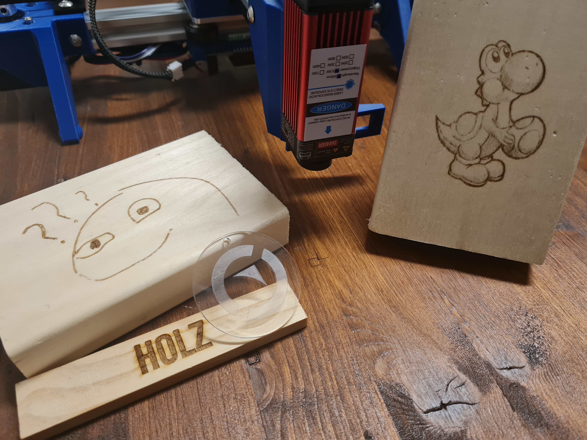
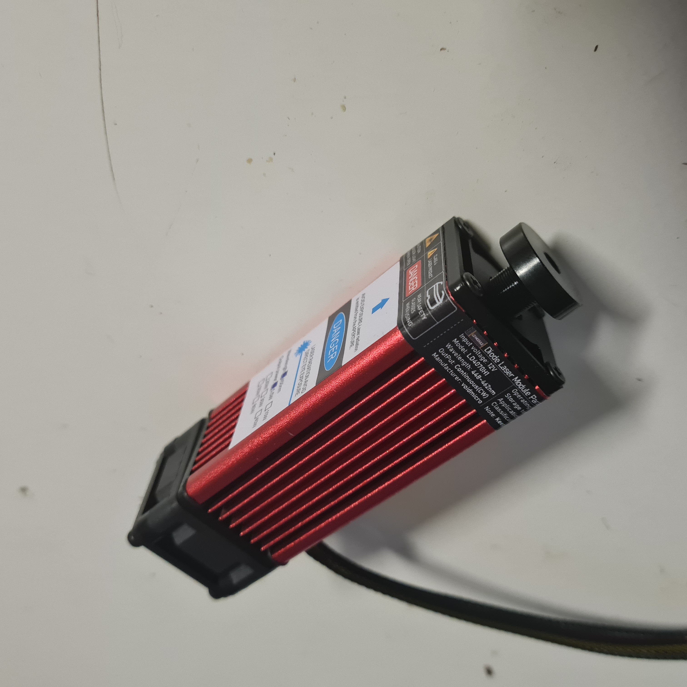
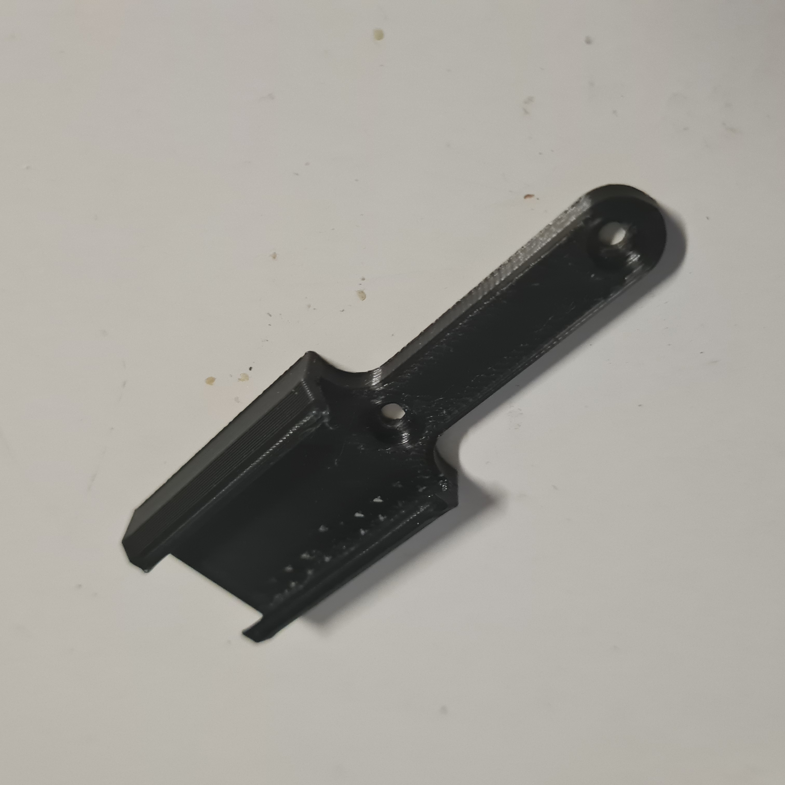
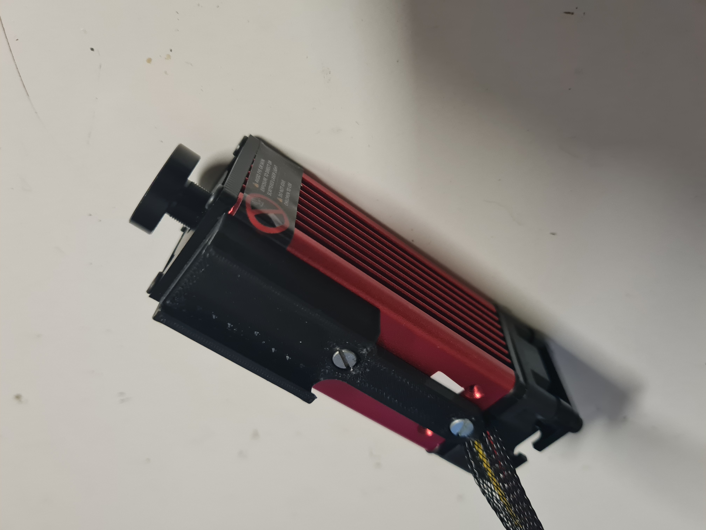
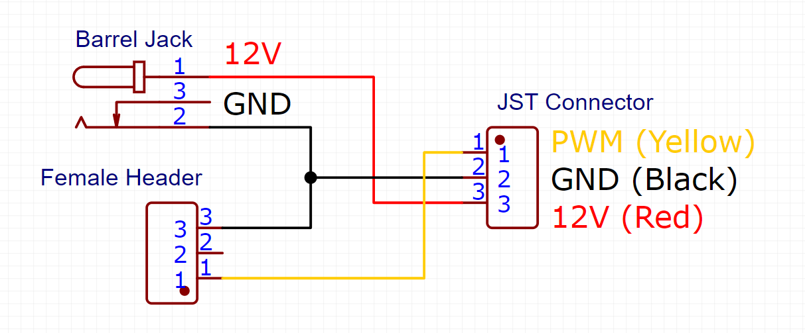
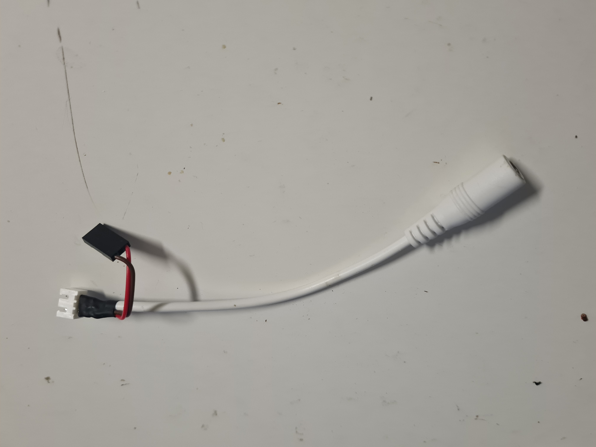
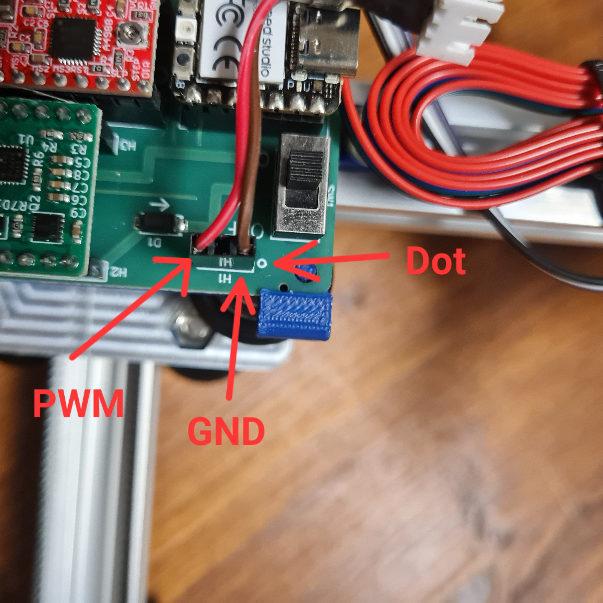
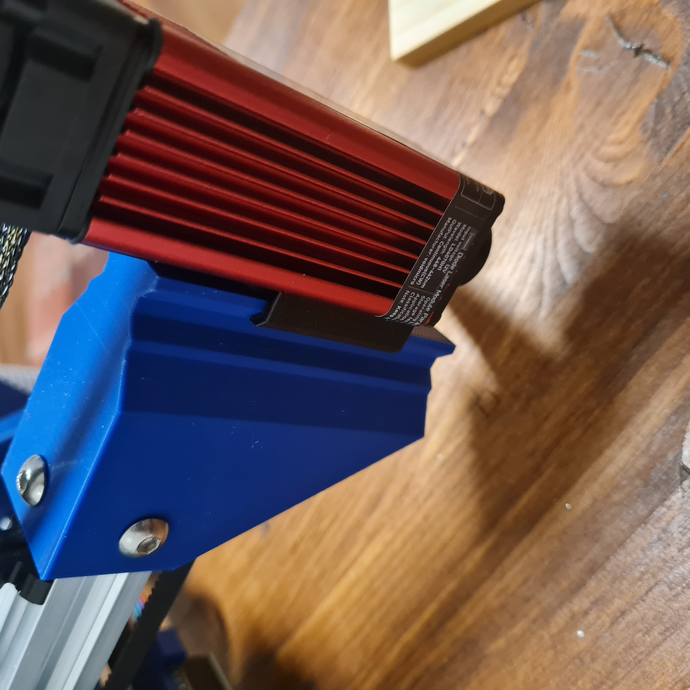

# My Blot Mods

This is a collection of modifications I've made to my [Blot](https://github.com/hackclub/blot/), a Plotter by Hackclub.

- [Tidy Cable Management](#tidy-cable-management)
- [Limit Switches](#limit-switches)
- [Laser Blot](#laser-blot)

## Tidy Cable Management

I just printed these [Cable Clips](https://www.thingiverse.com/thing:6466108) and secured the cables to it with zip ties.


## Limit Switches

This adds a pair of limit switches to the blot, utilizing the header of pins on the PCB.

### Parts

| Quantity | Name                                                    | Image                                                                             |
| -------- | ------------------------------------------------------- | --------------------------------------------------------------------------------- |
| 2        | Limit Switch / Microswitch                              |                      |
| 1        | M5x15 Screw                                             |                  |
| 1        | M5 T-Nut                                                |                         |
| 1        | 1x7 Angled Header                                       |            |
| 4        | ca. 20cm Wire                                           |                                                                                   |
| 1        | 3D Printed Mount [(here)](models/endstop_mount.stl)     |           |
| 1        | 3D Printed Arm [(here)](models/endstop_arm.stl)         |               |

### Assembly

1. Insert the Limit Switches into the 3D Printed Mount. Make sure the springs face the right direction. Like this:

    
2. Solder the Wires to the COM and NC pins of the Limit Switches.
    It should look like this:

    
3.  Solder the other ends of the wires to the 1x7 Angled Header. The COM pins both connect to 7th pin, the NC pin of the Lower (X) Limit Switch connects to the 3rd pin, and the NC pin of the Upper (Y) Limit Switch connects to the 4th pin.

    
4. Remove the top screw of the left motor mount.

    

    Then, put the 3D Printed Mount on top of the motor mount and screw it in place with the M5x15 (Keep the old screw for the next step). Adjust the position of the Limit Switches so it gets triggered before the gantry hits the end of the plotter.

    
5. Attach the 3D Printed Arm to top extrusion with the M5 T-Nut and the M5x10 screw that you removed in the last step.

    

    Make sure that when the gantry is at the limit switch, that the arm also triggers the switch before it hits the end of the plotter.
6. Plug the connector into the header on the PCB.

    

    Make sure the wires are not in the way of the gantry.

That's it!

### Firmware

I have created a grblHAL driver for the Blot. You can find it [here](https://github.com/Loewe111/grblHAL-blot). The only limitation is that it cant use the Servo for the pen lift.

I plan to modify the original firmware to support the limit switches as well.

## Laser Blot

I also added a 5.5W Diode Laser to my Blot. With this I am able to engrave wood, plastics and even acrylics, aswell as cutting paper and some thin wood.

> [!CAUTION]
> Lasers are dangerous! Always wear appropriate eye protection!



### Parts

| Quantity | Name                                                                                       | Image                                                                         |
| -------- | ------------------------------------------------------------------------------------------ | ----------------------------------------------------------------------------- |
| 1        | Laser Module (I got [this 5.5W one](https://de.aliexpress.com/item/1005003710714783.html)) |             |
| 1        | Laser Safety Glasses (I got [these](https://www.amazon.de/dp/B0CS6DHZRP))                  |                                                                               |
| 1        | A 12V Power Supply                                                                         |                                                                               |
| 1        | 3D Printed Laser Mount [(here)](models/laser_mount.stl)                                    |   |
| 1        | 12V Barrel Plug (Or other connector for the power supply)                                  |                                                                               |
| 1        | JST-XH 3 Pin Connector                                                                     |                                                                               |
| 1        | 3 Pin Female Header or Crimp Connector                                                     |                                                                               |
|          | Some Wires                                                                                 |                                                                               |

### Assembly

1. Attach the Laser Module to the 3D Printed Mount with the screws that came with the laser.

    

2. Create the wiring harness for the laser, by connecting the JST Connector to the Barrel Plug and the 3 Pin Connector as shown in the diagram below.

    

    My harness looks like this:

    

3. Connect the 3 Pin Female Header to the Pin Header on the PCB, where the Servo was connected. Make sure that the GND pin is on the side with the white dot.

    

4. Attach the Laser to the Arm, where the Pen Holder was attached.

    

    I also removed the Servo, but you can keep it if you want to use it in the future.

5. Connect the Laser to your Wiring Harness.

### Software

I use my [GrblHAL driver](https://github.com/Loewe111/grblHAL-blot) on the Blot, paired with [LightBurn](https://lightburnsoftware.com/) for the laser control.

Configure the driver with the following settings:

```gcode
$9=1
$30=1000
$31=0
$33=5000
$32=1
$110=8000
$111=8000
```

If you also have the limit switches installed (which I highly recommend), also set the following:

```gcode
$22=9
```

Otherwise you will have to manually set the origin with `G92X0Y0` before every job.

### Usage

Always wear the Laser Safety Glasses when the laser is on!

My workflow is as follows:

1. Home the machine.
2. Create my design in LightBurn.
3. Use the "Frame" function to align the design with the material.
4. Start the job.

---

Some of my settings with my 5.5W Laser

| Material      | Speed (mm/min) | Power (%) |
| ------------- | -------------- | --------- |
| Wood          | 750            | 100       |
| Acrylic       | 500            | 50        |
| PLA           | 1000           | 100       |

> [!TIP]
> When engraving Acrylic, I first cover the surface with black Whiteboard Marker and then wipe it off after engraving. This gives the laser a surface to engrave on, since it would just pass through the clear acrylic.